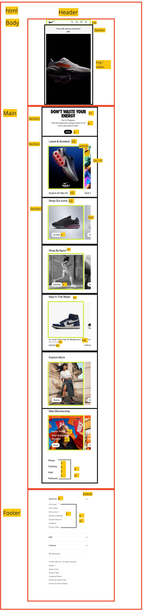
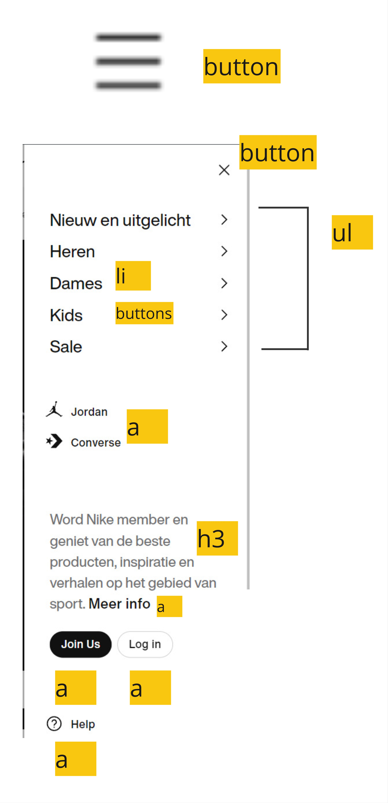
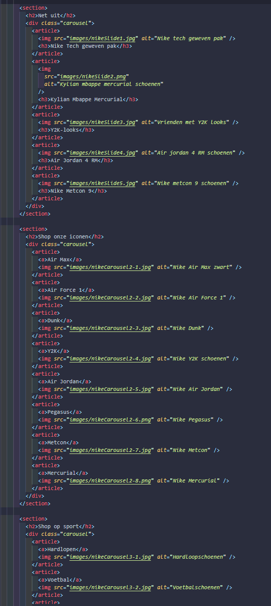

# Procesverslag

Markdown is een simpele manier om HTML te schrijven.  
Markdown cheat cheet: [Hulp bij het schrijven van Markdown](https://github.com/adam-p/markdown-here/wiki/Markdown-Cheatsheet).

Nb. De standaardstructuur en de spartaanse opmaak van de README.md zijn helemaal prima. Het gaat om de inhoud van je procesverslag. Besteedt de tijd voor pracht en praal aan je website.

Nb. Door _open_ toe te voegen aan een _details_ element kun je deze standaard open zetten. Fijn om dat steeds voor de relevante stuk(ken) te doen.

## Jij

  
uitwerken voor kick-off werkgroep

### Auteur:

Justin Admiraal

#### Je startniveau:

Rood

#### Je focus:

Surface

## Je website

  
uitwerken voor kick-off werkgroep

### Je opdracht:

nike.com/nl

#### Screenshot(s) van de eerste pagina (small screen):

hier de naam van de pagina  
 

#### Screenshot(s) van de tweede pagina (small screen):

hier de naam van de pagina  
 

## Toegankelijkheidstest 1/2 (week 1)

  
uitwerken na test in 2e werkgroep

### Bevindingen

Elastiek, schokband:
Als eerst had ik met elastiekjes om m'n vinger gedaan, en je merkt gelijk al dat alle basis dingen een stuk moeilijker zijn. Als je te snel typt gaat het al mis of als je simpel wilt swipen of klikken. Als je de tijd neemt gaat het wel wat makkelijker, dus het lukte wel alleen het duurt simpelweg een stuk langer. Met de schokband lukte het mij helemaal niet om te typen. Je kan wel de met de screenreader navigeren omdat je alleen op de toetsen hoeft te drukken.

Ik heb de site als eerst met een windows screenreader getest, maar die vond ik lastig te bedienen dus verliep de test niet zo soepel. Ik ga het nog een keer testen op mac.

Mac toegankelijkheids test bevindingen:

- Skip link naar main content
- Focus state op anchors, blauwe border, kan beter, mogelijk voor contrast? - - Focus state matcht niet persee website visueel gezien
- Goede alt tekst, ook op icons, etc. Ook hidden lists hidden voor screenreader
- Aria label op anchor links wanneer het een image is
- Media autoplayt
- Goed contrast algemeen, zwart op wit/wit op zwart
- Reduce motion op animatie

## Breakdownschets (week 1)

  
uitwerken na afloop 3e werkgroep

### de hele pagina:

  

### dynamisch deel (bijv menu):

  

### wellicht nog een dynamisch deel (bijv filter):

  

## Voortgang 1 (week 2)

  
uitwerken voor 1e voortgang

### Stand van zaken

hier dit ging goed & dit was lastig (neem ook screenshots op van delen van je website en code)

### Agenda voor meeting

Algemeen:

Wanneer divs gebruiken?
Wat zijn de regels rondom div?
Om de header uit te lijnen zou je dan grid moeten gebruiken?
Op welke manier krijg je de header die verandert?

Persoonlijk: Eerste pagina in html gemaakt, nog niet zeker over tweede pagina. In hoeverre zou je een filter systeem moeten maken indien je die pagina gaat maken?

Persoonlijk: Is de header nav met margins of in een grid?

Persoonlijk: Zijn het allemaal anchor tags op de pagina? Is de dropdown in de footer ook een anchor?

### Verslag van meeting

hier na afloop snel de uitkomsten van de meeting vastleggen

Feedback:
HTML/Code: Netjes, wat je zou kunnen doen is wat meer whitespace toevoegen tussen de sections. Je was al begonnen met de CSS, maar probeer wel minder margins te gebruiken.

Vragen beantwoord:

- De nav kan je met flexbox + margin/padding maken
- Je mag een andere video gebruiken, bijv nike promotie video, misschien screenrecording?
- Ja andere pagina = anchor
- Details element voor dropdown icoon
- Nav classlist
- Divjes zijn amper nodig op mijn pagina, bijv stukje tekst ene tekst links andere tekst rechts.

## Voortgang 2 (week 3)

  
uitwerken voor 2e voortgang

### Stand van zaken

 
 
 

### Agenda voor meeting

Waarvoor kan ik nog meer custom properties gebruiken bij mijn code behalve kleur?

Hoe zit het met de github images die niet laden

Voor al deze images mag ik een aparte folder maken?

Ik heb nu veel met headers positioneren met margins, moet dan eigenlijk met grid/flex bezig toch? - Is nu een soort bandaid fix.

Hoe zit het met tekst op een afbeelding, met positioning?

Maakt het uit als de header section geen h element heeft? (info bij w3s check)

In hoeverre hamburgermenu uitwerken?

### Verslag van meeting

hier na afloop snel de uitkomsten van de meeting vastleggen

- Antwoord op vragen:

- Voor custom properties: margins, paddings, border radius bijv
- (zelf proberen)
- Wat je zelf prefereert, wordt niet naar gekeken.
- Padding op de hele section zetten.
- Grid gebruiken voor de laatste carousel
- Opzich, maak er een h2 van ipv p om het toch te hebben. Volgorde van headings maakt niet uit.
- 1 menu item laten doorklikken, maken in de nav geneste ul's

## Toegankelijkheidstest 2/2 (week 4)

  
uitwerken na test in 9e werkgroep

### Bevindingen

Lijst met je bevindingen die in de test naar voren kwamen (geef ook aan wat er verbeterd is):

- Alle images hebben alt tekst, image wordt dus voorgelezen
- Screenreader werkt goed, iconen hebben ook een beschrijving, je kan door alles tabben.
  -HTML valid

- Alleen ze zeggen wel dat de buttons zijn opgemaakt als tekst, Kom er nu achter dat anchor tags geen href hebben, dus dat moet ik nog toevoegen. In de vorm van # of naar andere pagina linken
- Nog geen focus states voor klikbare elementen, anchors, buttons (:focus)
- Skip link toevoegen
- Reduced motion

## Voortgang 3 (week 4)

  
uitwerken voor 3e voortgang

### Stand van zaken

- Rest van css uitwerken ging goed
- Animatie maken was lastig, nog niet helemaal af.

hier dit ging goed & dit was lastig (neem ook screenshots op van delen van je website en code)

### Agenda voor meeting

- Hoe werkt het grid op afbeeldingen?
- Enig idee hoe ik de header animatie kan resetten?
- Voor alle margins en paddings variabelen gebruiken?

### Verslag van meeting

hier na afloop snel de uitkomsten van de meeting vastleggen

- Er stond nog een display flex op de parent dus grid werkte niet
- Mogelijk een reset of iets in de functie maar weten ze niet echt.
- Wanneer je het meerdere keren gebruikt wel

// Toevoegingen 5 surface plane

reduced motion
animaties?
custom properties?
misschien toegangelijkheid++

## Eindgesprek (week 5)

  
uitwerken voor eindgesprek

Surface plane:

- Dom manipulatie
- Header animatie
- Light/Dark mode
- Halloween thema
- Reduced motion
- Toegangelijkheid++ (aria labels/hidden, focus, skip link)
- Play/pause button

Micro interacties: details/summaries dropdown, hamburger menu, carousel slider

### Je uitkomst - karakteristiek screenshots:

  

### Dit ging goed/Heb ik geleerd:

Het namaken van de website qua kleuren/layout ging goed, ook de carousels gingen soepel nadat de eerste mij gelukt was. Verder duurde het maken van het hamburger menu wat langer maar hier heb ik veel van geleerd, samen met de animaties die erbij komen kijken/css animaties in het algemeen. Hiervoor had ik nooit echt css animaties veel gebruikt.

### Dit was lastig/Is niet gelukt:

- Animatie laten loopen

  

## Bronnenlijst

  
continu bijhouden terwijl je werkt

Nb. Wees specifiek ('css-tricks' als bron is bijv. niet specifiek genoeg).
Nb. ChatGpT en andere AI horen er ook bij.
Nb. Vermeld de bronnen ook in je code.

1. https://www.flaticon.com, https://icons8.com voor iconen
2. https://developer.mozilla.org/en-US/docs/Web/CSS/Child_combinator
3. https://developer.mozilla.org/en-US/docs/Web/HTML/Element/video
4. https://developer.mozilla.org/en-US/docs/Web/HTML/Element/a#skip_links
5. https://stackoverflow.com/questions/8683528/embed-image-in-a-button-element
6. chatGPT, gebruikt 1. Troubleshooting/uitleg algemeen 2. bewegende header Zie "chatgpt-bewegendeheader"
7. https://www.shecodes.io/athena/9754-how-to-create-a-dropdown-button-in-javascript
8. Copilot, hier en daar autosuggest
9. https://developer.mozilla.org/en-US/docs/Web/Accessibility/ARIA/Roles/button_role
10. https://developer.mozilla.org/en-US/docs/Web/CSS/@media/prefers-reduced-motion#user_preferences
11. https://web.dev/articles/prefers-reduced-motion
12. reduced motion, aria label https://chatgpt.com/c/66fa7254-8f20-8002-94a0-07da51a161d0
13. https://codepen.io/shooft/pen/VwJXNEg / https://chatgpt.com/c/66fb96a0-3a4c-8002-b45c-9f99aa92b5ba
14. https://www.youtube.com/watch?v=zFFuV_vXNhY&t
15. https://stackoverflow.com/questions/49500339/cant-prevent-touchmove-from-scrolling-window-on-ios\
16. hulp met menu problemen - https://chatgpt.com/share/67262fb7-20ac-8002-b7a6-dfb21bafaaf4
17. https://stackoverflow.com/questions/39839884/creating-a-custom-play-button-for-a-video

